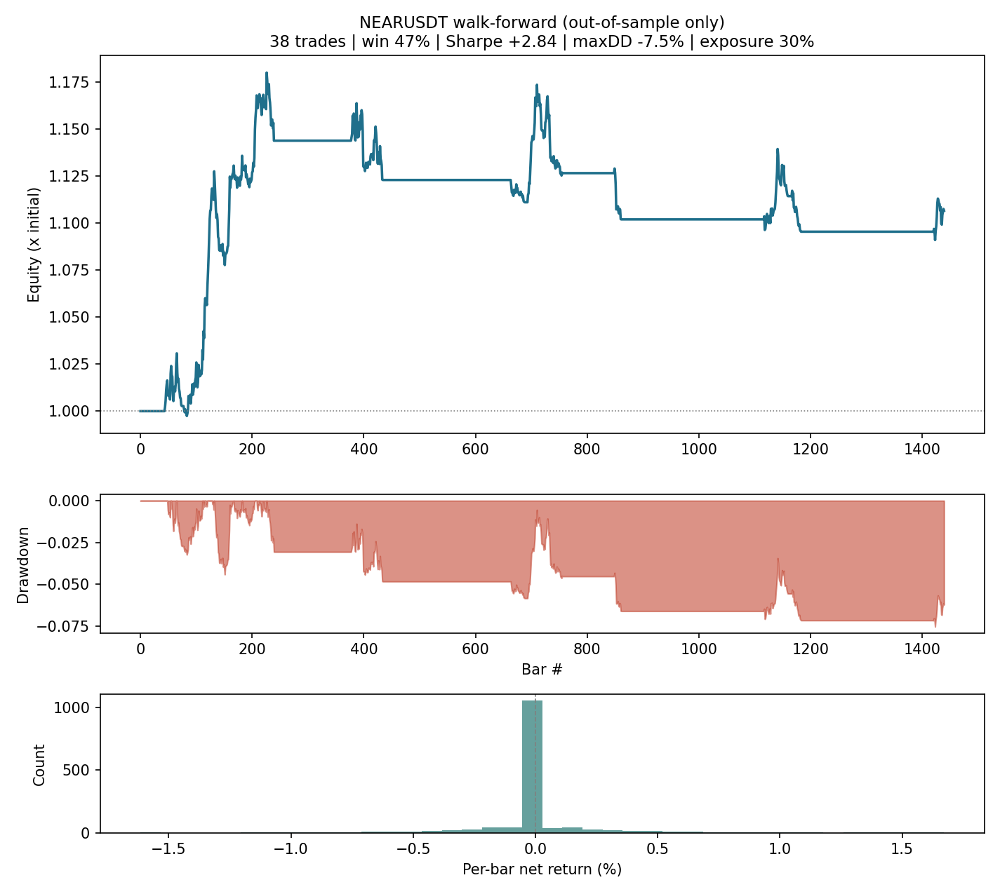

# NEAR Momentum Bot v2 — a trend engine that survives its fees

A research-first trading framework for **NEAR/USDT on Binance spot**. Its purpose is
not to present a winning strategy — it is to demonstrate **cost-aware backtesting and
walk-forward validation done honestly**, including the part where the honest answer is
"this isn't distinguishable from noise yet."

The project is built around one hard-won, robust finding: **on 91 days of real data,
the v1 4-minute scalper lost 82% out-of-sample** — the edge never survived 0.24%
round-trip costs. v2 is the disciplined response: a slower, cost-aware,
volatility-targeted trend engine, evaluated with the statistical caution the small
sample demands (see [Results](#results--and-why-they-are-not-a-performance-claim)).

[](https://github.com/ysmouhib/near-momentum-bot/actions/workflows/ci.yml)
[](https://www.python.org/)
[](https://github.com/astral-sh/ruff)
[](LICENSE)

**· [▶️ Browser simulator](https://ysmouhib.github.io/near-momentum-bot/simulator.html)** — run the engine on real Binance data with your own parameters, no install, no API key.

> **Not financial advice.** Educational research project. It defaults to the Binance
> **testnet** (paper trading). See the [disclaimer](#disclaimer).

## What's new in v2 (and why)

| v1 (the old bot) | v2 (this rewrite) |
|---|---|
| 4-minute bars | **60-minute bars** — costs are fixed per trade, trends scale with time |
| Six AND-ed binary gates | **Continuous conviction score**: vol-normalised TSMOM + Donchian breakout + smoothed taker-imbalance order flow |
| RSI band + volume spike | **Regime gates**: Kaufman efficiency-ratio chop filter + 200-bar trend filter |
| Entry/exit on the same threshold | **Hysteresis** (θ_in > θ_out): the no-trade band where edge < costs |
| Fixed quantity per trade | **Volatility-targeted sizing** (constant risk across regimes, capped at 100%) |
| Best-single-combo walk-forward | **Top-3 parameter ensemble**, Sharpe-based selection |
| Trade-list equity | **Per-bar mark-to-market** equity, exposure and drawdown |

The full reasoning — including the v1 failure analysis and the plateau-robustness
checks on every parameter — is in [`docs/STRATEGY.md`](docs/STRATEGY.md).

## Validation discipline, not performance claim

**Read this section as a worked example of validation discipline, not as evidence
that this strategy makes money.** The sample is far too small to conclude anything,
and the most useful thing this repo does is show *how to see that* rather than hide it.

Setup: real 91-day NEARUSDT data (April → July 2026), 60m bars, **0.10% taker fee +
0.02% slippage per side on every fill**. Walk-forward re-optimises a deliberately
small grid on rolling 30-day windows and reports **only the unseen 10-day windows
that follow**.

| Configuration | OOS return | Sharpe | Max DD | Trades |
|---|---|---|---|---|
| v1 scalper @ 4m (the old bot) | −82.4% | — | −82.5% | 714 |
| v1 scalper @ 60m | −9.4% | — | −17.0% | 39 |
| v2 @ 60m — walk-forward OOS | +10.7% | 2.84 | −7.5% | 38 |
| v2 @ 60m — 2× cost stress | +13.3% | 3.54 | −5.9% | 36 |
| v2 @ 60m — ETHUSDT (held-out symbol) | +5.8% | 2.15 | −7.5% | 26 |
| v2 @ 60m — SOLUSDT (held-out symbol) | +0.3% | 0.18 | −5.7% | 35 |

### The numbers above are statistically inconclusive, on purpose

I put a standard error on the headline before anyone else has to:

- **The trade count is inflated.** 38 "trades" are the legs of a **top-3 ensemble**
  over the same windows, so they are heavily correlated — the number of *independent
  decisions* is closer to ~13. A per-trade Sharpe of 2.84 estimated on ~13 effective,
  serially-dependent observations has a standard error wide enough that **the 95%
  confidence interval comfortably contains zero.** One Sharpe number on this sample
  is not evidence of skill; it is one draw from a wide distribution.
- **The 2× cost stress going *up* (+10.7% → +13.3%) is a warning, not a win.**
  Costs cannot improve any individual trade; the increase means the in-sample
  optimiser simply *selected different parameters* under stressed costs. The headline
  therefore swings by ±3 pts from perturbing the selection procedure alone — a direct
  measurement of overfitting/selection noise, which is why it is reported, not buried.
- **One market phase.** 91 days is a single trending regime for NEAR. ETH (+5.8%)
  and especially SOL (**+0.3%, i.e. nothing**) on the same window are the honest
  counter-evidence, deliberately left in.
- **Buy & hold beat it on raw return** (+38.2% over the same windows) with far larger
  drawdowns; the strategy was invested only ~30% of the time.

**Conclusion I actually stand behind:** on the only data tested, the v1 scalper is
*decisively* dead (−82%, a robust finding), and v2 is *not distinguishable from noise*
at this sample size. To claim v2 has an edge you would need multi-year data with
bootstrapped confidence intervals and a deflated Sharpe — the [roadmap](#roadmap-—-what-would-make-the-numbers-trustworthy)
says exactly this. The deliverable here is the machinery and the discipline to reach
that conclusion honestly, not the +10.7%.



Every number above is reproducible in two commands (see below) — including the ones
that undercut the strategy.

## Quickstart

```bash
git clone https://github.com/ysmouhib/near-momentum-bot.git
cd near-momentum-bot
pip install -e ".[dev,plot]"

# 1. Download 90 days of real 1m klines (no API key; Binance public dumps)
python scripts/download_data.py --symbol NEARUSDT --days 90

# 2. Fixed-config backtest (optimistic upper bound)
near-bot backtest --csv data/klines_1m.csv --trades --plot reports/backtest.png

# 3. Walk-forward validation (the number that actually matters)
near-bot walkforward --csv data/klines_1m.csv --plot reports/oos.png

# 4. (Optional) paper trade on the testnet
cp .env.example .env   # paste testnet keys from testnet.binance.vision
export $(cat .env | xargs)
near-bot test-connection
near-bot paper
```

A custom parameter grid for walk-forward can be supplied as YAML:

```yaml
# grid.yaml
theta_in: [0.15, 0.25, 0.35]
trail_atr: [2.5, 3.5]
er_min: [0.15, 0.25]
```

```bash
near-bot walkforward --csv data/klines_1m.csv --grid grid.yaml --top-k 3
```

## Try it in the browser

The **[live simulator](https://ysmouhib.github.io/near-momentum-bot/simulator.html)**
runs the exact engine on real Binance history: public 1-minute klines are fetched
straight from your browser (no account or API key), every parameter is adjustable,
and you can run either a fixed-config backtest or full **walk-forward validation
in-page**. The JavaScript engine ([`docs/engine.js`](docs/engine.js)) is pinned to
the Python engine by an automated parity check (`experiments/parity_check.js`) —
identical trades on shared fixtures, verified in CI. Where Binance's API is
geo-blocked, upload a CSV written by `scripts/download_data.py` instead.

## Architecture

```
1m klines (REST API or data.binance.vision dumps)
      → aggregate to N-minute bars → causal indicators → conviction score
                                                                │
                ┌───────────────────┬───────────────────────────┴──────────┐
                ▼                   ▼                                        ▼
        backtest engine      walk-forward validator                   live executor
   (hysteresis, vol-target,  (Sharpe selection, top-3              (testnet / live,
    per-bar MTM, fees)        ensemble, OOS-only report)            same score + sizing)
```

```
src/near_bot/
├── config.py       # typed config (YAML + env secrets)
├── data.py         # klines parsing, N-minute aggregation, dump-zip loading
├── indicators.py   # TSMOM, efficiency ratio, Donchian position, OFI z-score, ATR, vol
├── score.py        # the composite conviction score + regime gates
├── backtest.py     # hysteresis loop, vol-target sizing, per-bar MTM accounting
├── walkforward.py  # Sharpe selection, top-k ensemble, embargo option
├── report.py       # equity vs buy&hold, drawdown, exposure, return plots
├── dump_client.py  # data.binance.vision public dumps (no key, no geo-block)
├── broker.py       # Binance spot wrapper (paginated klines, lot-size, min-notional)
├── executor.py     # paper/live loop (same score, same sizing, real fill prices)
└── cli.py          # command-line entry point
```

Every trading decision flows through the same `score.compute()` +
`backtest.position_weight()` code, so what you backtest is what you run.

## Development

```bash
pytest -q                              # 32-test suite
ruff check src tests                   # lint
python experiments/make_fixtures.py    # regenerate parity fixtures
node experiments/parity_check.js       # JS engine == Python engine
```

CI runs the suite and linter on Python 3.10–3.12, plus the engine parity check,
on every push and pull request.

## Roadmap — what would make the numbers trustworthy

The current results are a proof-of-machinery on a small sample, not evidence of edge.
The gap between "interesting" and "believable" is entirely statistical, and named here
so it isn't hidden:

- [ ] **Multi-year data** across several regimes, with fixed, dated windows so a run
      is exactly reproducible (not a rolling "last 90 days").
- [ ] **Bootstrapped confidence intervals** on OOS Sharpe and expectancy, plus a
      **deflated Sharpe ratio** (Bailey–López de Prado) to charge for the number of
      configurations tried.
- [ ] **Report independent decisions, not ensemble legs** — deduplicate correlated
      trades so the count reflects real degrees of freedom.
- [ ] **Ablation table**: each score component alone vs. the ensemble, to show the
      order-flow term earns its place.
- [ ] **Paper-trading log**: forward testnet fills over time — worth more than any backtest.
- [ ] Binance USD-M futures broker for the symmetric short side; regime classifier.

## Disclaimer

For educational purposes only. Nothing here is financial advice. Cryptocurrency
trading carries substantial risk of loss. Backtested and simulated results —
including out-of-sample ones — do not guarantee future performance. Use the
testnet, and never trade money you cannot afford to lose. The authors accept no
liability for any losses.

## License

[MIT](LICENSE)

